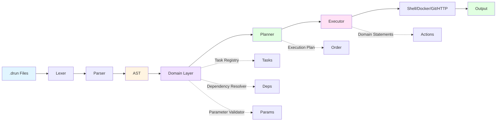
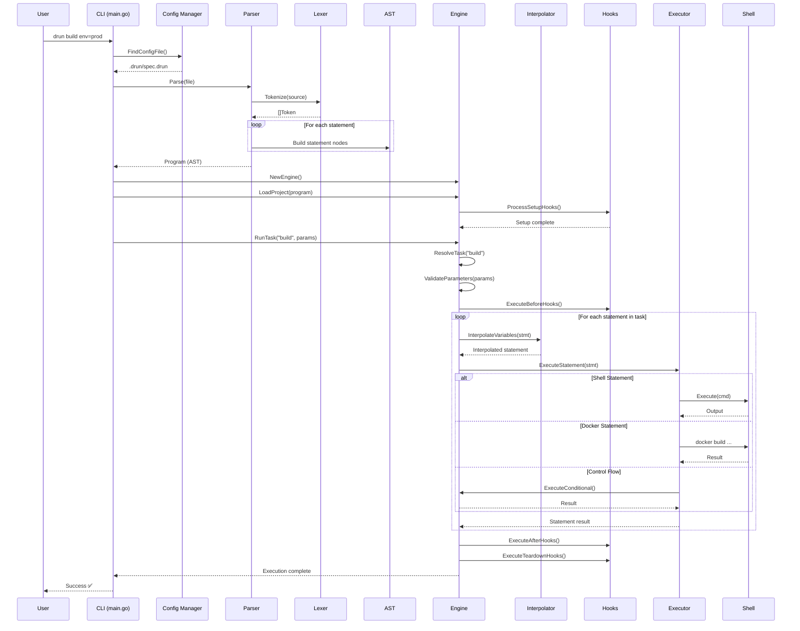
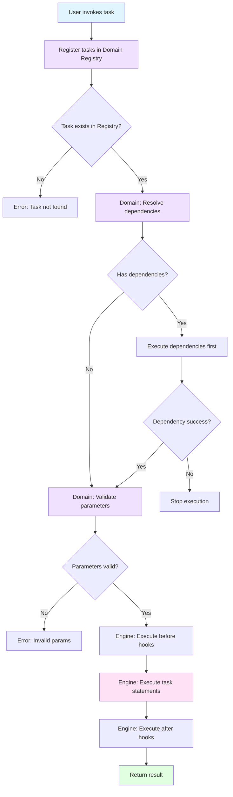
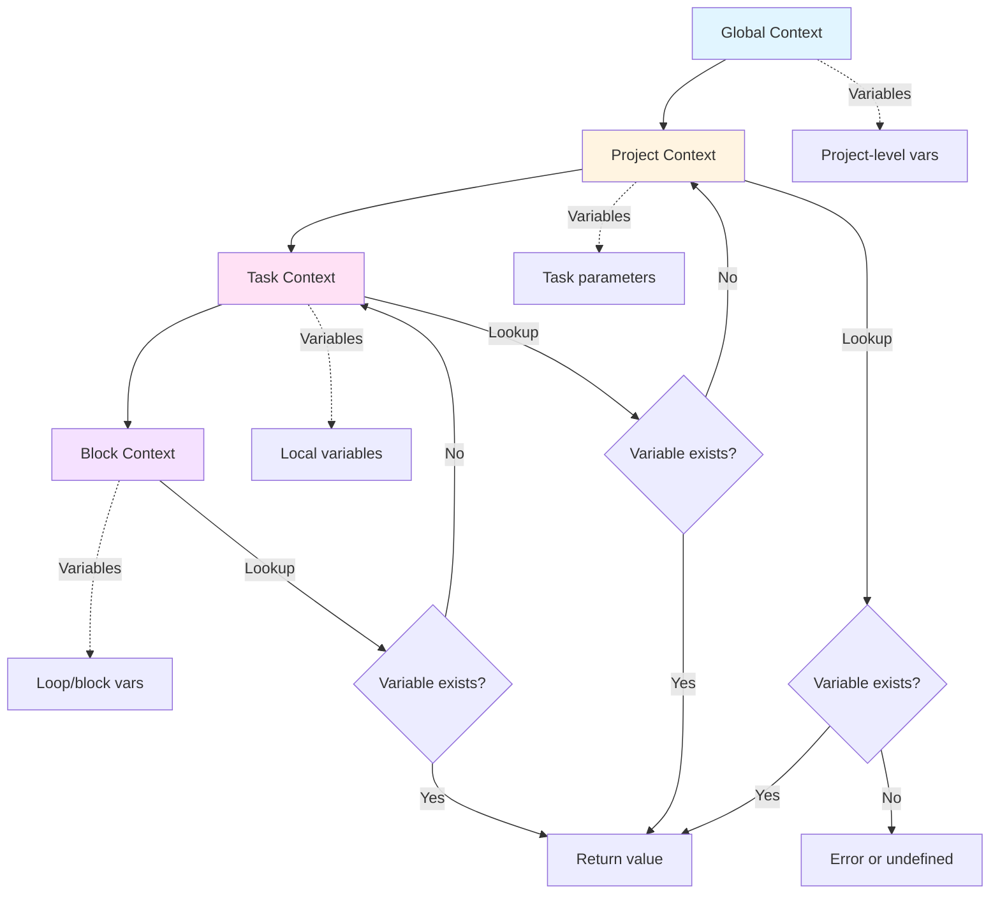
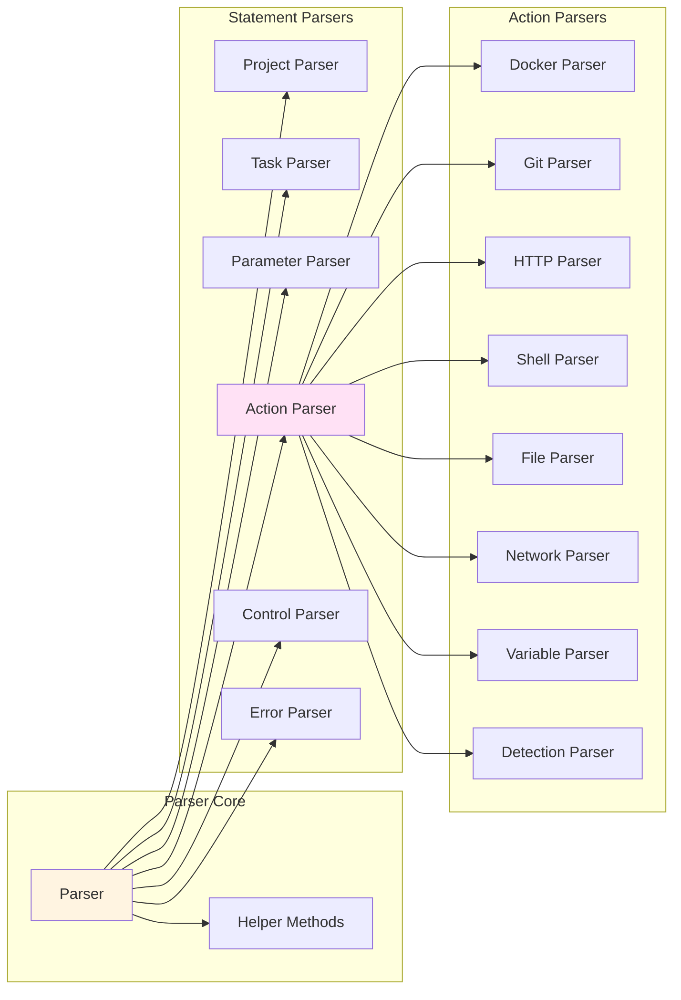
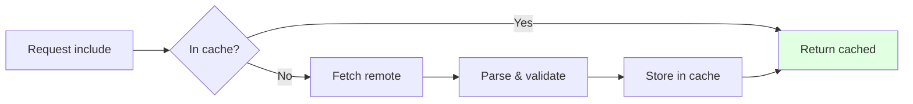

# drun Architecture Guide

**Version:** 2.1.0  
**Last Updated:** October 9, 2025  
**Status:** Production (Modular Architecture with Debug Diagnostics)

---

## Table of Contents

1. [Overview](#overview)
2. [System Architecture](#system-architecture)
3. [Package Organization](#package-organization)
4. [Execution Flow](#execution-flow)
5. [Data Flow](#data-flow)
6. [Component Interactions](#component-interactions)
7. [Key Design Patterns](#key-design-patterns)
8. [Extension Points](#extension-points)

---

## Overview

drun is a task automation tool that executes declarative task definitions written in the drun language. The system follows a **modular pipeline architecture** where source code flows through distinct stages: lexing → parsing → domain modeling → planning → execution.

### High-Level Architecture



### Core Principles

1. **Separation of Concerns** - Each package has a single, well-defined responsibility
2. **Domain-Driven Design** - Business logic separated from infrastructure details
3. **Dependency Injection** - Infrastructure dependencies are pluggable and testable
4. **Explicit Planning** - Execution plans are built upfront, eliminating redundant AST scans
5. **Testability** - Components can be tested in isolation
6. **Extensibility** - New features can be added without modifying existing code

---

## System Architecture

### Complete System Diagram

```mermaid
graph TB
    subgraph "CLI Layer"
        CLI[cmd/drun/main.go]
        UPDATE[app/update.go]
        CONFIG[app/config.go]
        COMPLETE[app/completion.go]
    end
    
    subgraph "Domain Layer"
        TASK_REG[task/registry.go]
        TASK_DEP[task/dependencies.go]
        TASK_DOMAIN[task/task.go]
        PARAM_VAL[parameter/validation.go]
        PROJ[project/project.go]
        STMT[statement/statement.go]
        
        style TASK_REG fill:#f0e1ff
        style TASK_DEP fill:#f0e1ff
        style PARAM_VAL fill:#f0e1ff
        style STMT fill:#f0e1ff
    end
    
    subgraph "Core Engine"
        ENGINE[engine/engine.go]
        CONTEXT[engine/context.go]
        PLANNER[planner/planner.go]
        EXECUTOR[executor/executor.go]
        
        subgraph "Engine Subsystems"
            INTERP[interpolation/]
            HOOKS[hooks/]
            INCLUDES[includes/]
        end
        
        subgraph "Executors"
            EXE_ERROR[executor_error.go]
            EXE_CONTROL[executor_control.go]
            EXE_VAR[executor_variables.go]
            EXE_SHELL[executor_shell.go]
            EXE_FILE[executor_file.go]
            EXE_NET[executor_network.go]
            EXE_DOCKER[executor_docker.go]
            EXE_GIT[executor_git.go]
            EXE_HTTP[executor_http.go]
            EXE_DETECT[executor_detection.go]
        end
        
        subgraph "Helpers"
            HELP_BUILD[helpers_builders.go]
            HELP_COND[helpers_conditions.go]
            HELP_DETECT[helpers_detection.go]
            HELP_DOWN[helpers_download.go]
            HELP_EXPR[helpers_expressions.go]
            HELP_FS[helpers_filesystem.go]
            HELP_UTIL[helpers_utilities.go]
        end
    end
    
    CLI --> ENGINE
    ENGINE --> TASK_REG
    ENGINE --> TASK_DEP
    ENGINE --> PARAM_VAL
    
    subgraph "Parser Layer"
        PARSER[parser/parser.go]
        P_PROJECT[parser_project.go]
        P_TASK[parser_task.go]
        P_PARAM[parser_parameter.go]
        P_ACTION[parser_action.go]
        P_CONTROL[parser_control.go]
        P_ERROR[parser_error.go]
        P_DOCKER[parser_docker.go]
        P_GIT[parser_git.go]
        P_HTTP[parser_http.go]
        P_SHELL[parser_shell.go]
        P_FILE[parser_file.go]
        P_NET[parser_network.go]
        P_VAR[parser_variable.go]
        P_DETECT[parser_detection.go]
        P_HELPER[parser_helper.go]
    end
    
    subgraph "AST Layer"
        AST[ast/ast.go]
        AST_PROJECT[ast_project.go]
        AST_TASK[ast_task.go]
        AST_PARAM[ast_parameter.go]
        AST_CONTROL[ast_control.go]
        AST_ACTION[ast_action.go]
        AST_SHELL[ast_shell.go]
        AST_FILE[ast_file.go]
        AST_DOCKER[ast_docker.go]
        AST_GIT[ast_git.go]
        AST_HTTP[ast_http.go]
        AST_NET[ast_network.go]
        AST_VAR[ast_variable.go]
        AST_DETECT[ast_detection.go]
        AST_EXPR[ast_expressions.go]
    end
    
    subgraph "Lexer Layer"
        LEXER[lexer/lexer.go]
        TOKENS[tokens.go]
    end
    
    subgraph "Support Services"
        BUILTINS[builtins/]
        SHELL[shell/]
        DETECTION[detection/]
        REMOTE[remote/]
        CACHE[cache/]
        ERRORS[errors/]
        TYPES[types/]
    end
    
    CLI --> ENGINE
    UPDATE -.-> CLI
    CONFIG -.-> CLI
    COMPLETE -.-> CLI
    
    ENGINE --> CONTEXT
    ENGINE --> INTERP
    ENGINE --> HOOKS
    ENGINE --> INCLUDES
    ENGINE --> EXE_ERROR
    ENGINE --> EXE_CONTROL
    ENGINE --> EXE_VAR
    ENGINE --> EXE_SHELL
    ENGINE --> EXE_FILE
    ENGINE --> EXE_NET
    ENGINE --> EXE_DOCKER
    ENGINE --> EXE_GIT
    ENGINE --> EXE_HTTP
    ENGINE --> EXE_DETECT
    
    EXE_ERROR --> HELP_COND
    EXE_CONTROL --> HELP_COND
    EXE_VAR --> HELP_EXPR
    EXE_SHELL --> HELP_UTIL
    EXE_FILE --> HELP_FS
    EXE_NET --> HELP_DOWN
    EXE_DOCKER --> HELP_BUILD
    EXE_GIT --> HELP_BUILD
    EXE_HTTP --> HELP_BUILD
    EXE_DETECT --> HELP_DETECT
    
    ENGINE --> PARSER
    PARSER --> P_PROJECT
    PARSER --> P_TASK
    PARSER --> P_PARAM
    PARSER --> P_ACTION
    PARSER --> P_CONTROL
    PARSER --> P_ERROR
    
    P_PROJECT --> AST_PROJECT
    P_TASK --> AST_TASK
    P_PARAM --> AST_PARAM
    P_ACTION --> AST_ACTION
    P_CONTROL --> AST_CONTROL
    P_ERROR --> AST_CONTROL
    P_DOCKER --> AST_DOCKER
    P_GIT --> AST_GIT
    P_HTTP --> AST_HTTP
    P_SHELL --> AST_SHELL
    P_FILE --> AST_FILE
    P_NET --> AST_NET
    P_VAR --> AST_VAR
    P_DETECT --> AST_DETECT
    
    PARSER --> LEXER
    LEXER --> TOKENS
    
    ENGINE --> BUILTINS
    ENGINE --> SHELL
    ENGINE --> DETECTION
    ENGINE --> REMOTE
    ENGINE --> CACHE
    ENGINE --> ERRORS
    ENGINE --> TYPES
    
    style CLI fill:#e1f5ff
    style ENGINE fill:#ffe1f5
    style PARSER fill:#fff4e1
    style AST fill:#e1ffe1
    style LEXER fill:#f5e1ff
```



---

## Package Organization

### Directory Structure

```
drun/
├── cmd/drun/              # CLI entry point and commands
│   ├── main.go            # Minimal entry point (440 lines)
│   └── app/               # CLI application modules
│       ├── update.go      # Self-update logic (387 lines)
│       ├── config.go      # Configuration management (329 lines)
│       ├── completion.go  # Shell completion (48 lines)
│       └── runner.go      # Task runner (6 lines - reserved)
│
├── internal/
│   ├── ast/               # Abstract Syntax Tree definitions
│   │   ├── ast.go                # Core AST types (209 lines)
│   │   ├── ast_project.go        # Project declarations
│   │   ├── ast_task.go           # Task definitions
│   │   ├── ast_parameter.go      # Parameter types
│   │   ├── ast_control.go        # Control flow (if/for/try)
│   │   ├── ast_action.go         # Action statements
│   │   ├── ast_shell.go          # Shell commands
│   │   ├── ast_file.go           # File operations
│   │   ├── ast_docker.go         # Docker actions
│   │   ├── ast_git.go            # Git actions
│   │   ├── ast_http.go           # HTTP actions
│   │   ├── ast_network.go        # Network operations
│   │   ├── ast_variable.go       # Variable operations
│   │   ├── ast_detection.go      # Tool detection
│   │   └── ast_expressions.go    # Expressions and operators
│   │
│   ├── parser/            # Syntax parser
│   │   ├── parser.go              # Core parser (115 lines)
│   │   ├── parser_project.go      # Project parsing
│   │   ├── parser_task.go         # Task parsing
│   │   ├── parser_parameter.go    # Parameter parsing
│   │   ├── parser_action.go       # Action parsing
│   │   ├── parser_control.go      # Control flow parsing
│   │   ├── parser_error.go        # Error handling parsing
│   │   ├── parser_docker.go       # Docker action parsing
│   │   ├── parser_git.go          # Git action parsing
│   │   ├── parser_http.go         # HTTP action parsing
│   │   ├── parser_shell.go        # Shell command parsing
│   │   ├── parser_file.go         # File operation parsing
│   │   ├── parser_network.go      # Network operation parsing
│   │   ├── parser_variable.go     # Variable operation parsing
│   │   ├── parser_detection.go    # Detection parsing
│   │   └── parser_helper.go       # Helper methods
│   │
│   ├── domain/            # Domain layer (decoupled from AST)
│   │   ├── task/
│   │   │   ├── task.go            # Domain task entity
│   │   │   ├── registry.go        # Task registration
│   │   │   └── dependencies.go    # Dependency resolution
│   │   ├── parameter/
│   │   │   ├── parameter.go       # Parameter entity
│   │   │   └── validation.go      # Validation logic
│   │   ├── project/
│   │   │   └── project.go         # Project entity
│   │   └── statement/
│   │       ├── statement.go       # Domain statement types
│   │       └── converter.go       # AST↔Domain converters
│   │
│   ├── engine/            # Execution engine
│   │   ├── engine.go              # Core orchestration
│   │   ├── context.go             # Execution context
│   │   ├── options.go             # Options-based configuration
│   │   │
│   │   ├── planner/               # Execution planning
│   │   │   ├── planner.go         # Dependency resolution & plan generation
│   │   │   └── planner_test.go    # Planner tests
│   │   │
│   │   ├── executor/              # Task execution
│   │   │   ├── executor.go        # Task & hook executor
│   │   │   └── executor_test.go   # Executor tests
│   │   │
│   │   ├── interpolation/         # Variable interpolation subsystem
│   │   │   ├── interpolator.go    # Main interpolator
│   │   │   ├── resolvers.go       # Variable resolvers
│   │   │   ├── conditional.go     # Conditional interpolation
│   │   │   └── utilities.go       # Helper utilities
│   │   │
│   │   ├── hooks/                 # Lifecycle hooks subsystem
│   │   │   └── manager.go         # Hook management
│   │   │
│   │   ├── includes/              # Include resolution subsystem
│   │   │   └── resolver.go        # Include resolver
│   │   │
│   │   ├── executor_error.go      # Error handling executor
│   │   ├── executor_control.go    # Control flow executor
│   │   ├── executor_variables.go  # Variable operations executor
│   │   ├── executor_shell.go      # Shell command executor
│   │   ├── executor_file.go       # File operations executor
│   │   ├── executor_network.go    # Network operations executor
│   │   ├── executor_docker.go     # Docker actions executor
│   │   ├── executor_git.go        # Git actions executor
│   │   ├── executor_http.go       # HTTP actions executor
│   │   ├── executor_detection.go  # Detection executor
│   │   │
│   │   ├── helpers_builders.go    # Command builders
│   │   ├── helpers_conditions.go  # Condition evaluation
│   │   ├── helpers_detection.go   # Detection helpers
│   │   ├── helpers_download.go    # Download helpers
│   │   ├── helpers_expressions.go # Expression evaluation
│   │   ├── helpers_filesystem.go  # Filesystem helpers
│   │   └── helpers_utilities.go   # General utilities
│   │
│   ├── lexer/             # Lexical analysis
│   │   ├── lexer.go               # Token generation
│   │   ├── tokens.go              # Token definitions
│   │   └── ...
│   │
│   ├── debug/             # Debug utilities and diagnostics
│   │   ├── debug.go               # Core debug functions
│   │   └── plan.go                # Execution plan visualization
│   ├── builtins/          # Built-in functions
│   ├── shell/             # Shell execution
│   ├── detection/         # Tool detection
│   ├── remote/            # Remote file fetching
│   ├── cache/             # Caching system
│   ├── errors/            # Error handling
│   ├── types/             # Type definitions
│   └── ...
│
└── examples/              # Example drun files (62 files)
```

---

## Execution Flow

### Complete Execution Pipeline



### Task Resolution Flow



---

## Modular Architecture

### Domain Model Decoupling

The domain layer is fully decoupled from the AST, providing clean domain-level representations:

**Domain Statement Types** (`internal/domain/statement/`)
- Action, Shell, Variable, Conditional, Loop, Try/Catch
- File, Docker, Git, HTTP, Download, Network, Detection
- Break, Continue, TaskCall, UseSnippet

**Bidirectional Converters** (`statement/converter.go`)
- `FromAST()` - Converts AST nodes to domain statements
- `ToAST()` - Temporary conversion for execution (being phased out)

**Domain Entities**
- `task.Task` - Task with domain statements instead of AST nodes
- `project.Project` - Project with domain-level hooks
- `parameter.Parameter` - Parameter with validation rules

### Execution Planning

The **Planner** (`internal/engine/planner/`) generates comprehensive execution plans upfront:

```go
type ExecutionPlan struct {
    TargetTask     string
    ExecutionOrder []string
    Tasks          map[string]*TaskPlan
    Hooks          *HookPlan
    ProjectName    string
    ProjectVersion string
    Namespaces     map[string]bool
}
```

**Benefits:**
- Single AST scan instead of repeated traversals
- Deterministic execution order
- Complete dependency resolution upfront
- Rich metadata for debugging

### Task Execution

The **Executor** (`internal/engine/executor/`) handles task and hook execution:

```go
type Executor struct {
    output             io.Writer
    dryRun             bool
    domainStmtExecutor DomainStatementExecutor
}
```

**Responsibilities:**
- Execute tasks using domain statements
- Execute lifecycle hooks (setup, before, after, teardown)
- Delegate statement execution to the engine
- Handle dry-run mode

### Dependency Injection

The engine uses an **options-based constructor** for pluggable infrastructure:

```go
engine := NewEngineWithOptions(
    WithOutput(os.Stdout),
    WithTaskRegistry(customRegistry),
    WithCacheManager(customCache),
    WithVerbose(true),
)
```

**Injectable Dependencies:**
- Task Registry
- Parameter Validator
- Dependency Resolver
- Cache Manager
- Remote Fetchers
- Interpolator

### Debug & Visualization Tools

**Execution Plan Diagnostics** (`internal/debug/plan.go`)

Export execution plans in multiple formats:
- **Graphviz DOT** - For rendering dependency graphs
- **Mermaid** - For markdown diagrams  
- **JSON** - For programmatic analysis

**CLI Debug Flags:**
```bash
# View execution plan
xdrun --debug --debug-domain --debug-plan -f myfile.drun

# Export formats
xdrun --debug --debug-domain \
  --debug-export-graph plan \
  --debug-export-mermaid plan \
  --debug-export-json plan \
  -f myfile.drun
```

**Plan Visualization Features:**
- Execution order with task metadata
- Dependency relationships
- Parallel execution opportunities
- Hook integration points
- Project and namespace information

---

## Data Flow

### Variable Resolution and Interpolation

```mermaid
flowchart LR
    A["Source: &#123;$var&#125;"] --> B[Interpolator]
    
    B --> C{Variable type?}
    
    C -->|Simple| D[Lookup in context]
    C -->|Expression| E[Evaluate expression]
    C -->|Conditional| F[Evaluate condition]
    C -->|Environment| G[Read from env]
    
    D --> H[Apply transformations]
    E --> H
    F --> H
    G --> H
    
    H --> I{Operations?}
    I -->|Yes| J[Apply operations<br/>filter/sort/split]
    I -->|No| K[Return value]
    J --> K
    
    style B fill:#ffe1f5
    style H fill:#fff4e1
```



### Context Hierarchy



---

## Component Interactions

### Engine Subsystem Interactions

```mermaid
graph TB
    subgraph "Engine Core"
        E[Engine]
        CTX[Context Manager]
    end
    
    subgraph "Interpolation System"
        I[Interpolator]
        IR[Resolvers]
        IC[Conditional Logic]
        IU[Utilities]
    end
    
    subgraph "Hooks System"
        HM[Hook Manager]
        HS[Setup Hooks]
        HB[Before/After Hooks]
        HT[Teardown Hooks]
    end
    
    subgraph "Includes System"
        IN[Include Resolver]
        IC2[Cache Manager]
        IR2[Remote Fetcher]
    end
    
    subgraph "Executors"
        EE[Error Executor]
        EC[Control Executor]
        EV[Variable Executor]
        ES[Shell Executor]
        EF[File Executor]
        EN[Network Executor]
        ED[Docker Executor]
        EG[Git Executor]
        EH[HTTP Executor]
        EDT[Detection Executor]
    end
    
    E --> CTX
    E --> I
    E --> HM
    E --> IN
    
    I --> IR
    I --> IC
    I --> IU
    
    HM --> HS
    HM --> HB
    HM --> HT
    
    IN --> IC2
    IN --> IR2
    
    E --> EE
    E --> EC
    E --> EV
    E --> ES
    E --> EF
    E --> EN
    E --> ED
    E --> EG
    E --> EH
    E --> EDT
    
    EC --> I
    EV --> I
    ES --> I
    EF --> I
    EN --> I
    ED --> I
    EG --> I
    EH --> I
    
    style E fill:#ffe1f5
    style I fill:#e1f5ff
    style HM fill:#fff4e1
    style IN fill:#e1ffe1
```



### Parser Subsystem Interactions



---

## Key Design Patterns

### 1. Strategy Pattern (Executors)

Each executor implements statement execution for a specific domain:

```go
// Engine delegates to appropriate executor
func (e *Engine) executeStatement(stmt ast.Statement, ctx *ExecutionContext) error {
    switch s := stmt.(type) {
    case *ast.TryStatement:
        return e.executeTry(s, ctx)
    case *ast.ConditionalStatement:
        return e.executeConditional(s, ctx)
    case *ast.ShellStatement:
        return e.executeShell(s, ctx)
    case *ast.DockerStatement:
        return e.executeDocker(s, ctx)
    // ... more executors
    }
}
```

### 2. Visitor Pattern (AST Traversal)

The engine "visits" each AST node and executes it:

```go
for _, stmt := range task.Statements {
    if err := e.executeStatement(stmt, ctx); err != nil {
        return err
    }
}
```

### 3. Template Method Pattern (Execution Flow)

Base execution flow with hooks at specific points:

```
1. Setup hooks
2. Before task hooks
3. Execute task statements
4. After task hooks
5. Teardown hooks
```

### 4. Builder Pattern (Command Construction)

Helpers build complex commands step by step:

```go
func (e *Engine) buildDockerCommand(stmt *ast.DockerStatement) []string {
    cmd := []string{"docker", stmt.Action}
    // Add flags, options, arguments...
    return cmd
}
```

### 5. Facade Pattern (Engine API)

Engine provides simple API hiding complex subsystems:

```go
engine := NewEngine(os.Stdout)
engine.LoadProject(program)
engine.RunTask("build", params)
```

### 6. Registry Pattern (Hook Management)

Hooks registered and retrieved by type:

```go
hookManager.RegisterHook("setup", hook)
hooks := hookManager.GetHooks("before")
```

---

## Extension Points

### Adding New Actions

1. **Define AST Node** (`internal/ast/ast_yourfeature.go`)
```go
type YourActionStatement struct {
    Action string
    Target string
    // ... fields
}
```

2. **Add Parser** (`internal/parser/parser_yourfeature.go`)
```go
func (p *Parser) parseYourAction() (*ast.YourActionStatement, error) {
    // Parse tokens into AST
}
```

3. **Add Executor** (`internal/engine/executor_yourfeature.go`)
```go
func (e *Engine) executeYourAction(stmt *ast.YourActionStatement, ctx *ExecutionContext) error {
    // Execute the action
}
```

4. **Wire it up** in `engine.go`:
```go
case *ast.YourActionStatement:
    return e.executeYourAction(s, ctx)
```

### Adding New Interpolation Operations

Add to `internal/engine/interpolation/resolvers.go`:

```go
case "yourOperation":
    return applyYourOperation(value, params)
```

### Adding New Built-in Functions

Add to `internal/builtins/builtins.go`:

```go
func YourFunction(args ...string) (string, error) {
    // Implementation
}
```

---

## Performance Considerations

### Caching Strategy



### Parallel Execution

```go
// Parallel execution for "in parallel" blocks
for each item in parallel {
    go func(item) {
        execute(item)
    }(item)
}
```

---

## Testing Strategy

### Test Pyramid

```
        /\
       /  \
      /E2E \          62 example files
     /______\
    /        \
   / Integr.  \       Engine tests
  /____________\
 /              \
/   Unit Tests   \    Parser, Lexer, AST tests
/__________________\
```

### Test Organization

- **Unit Tests**: Each package tests its own functionality
- **Integration Tests**: Engine tests with real examples
- **Regression Tests**: All 62 example files must pass
- **Benchmark Tests**: Performance monitoring

---

## Summary

The drun architecture follows a **modular, domain-driven design** with clear separation between:

1. **CLI Layer** - User interaction and command handling
2. **Parser Layer** - Syntax analysis and AST generation
3. **Domain Layer** - Business logic decoupled from AST
4. **Planning Layer** - Execution plan generation
5. **Execution Layer** - Task and hook execution
6. **Support Services** - Utilities and cross-cutting concerns

### Key Architecture Features

✅ **Domain-Driven Design** - Business logic separated from infrastructure  
✅ **Explicit Planning** - Upfront execution plan eliminates redundant scans  
✅ **Dependency Injection** - Pluggable infrastructure for testability  
✅ **Modular Components** - Planner, Executor, and Engine work together cleanly  
✅ **Debug Diagnostics** - Rich visualization tools for complex workflows  
✅ **Testable** - Components can be tested in isolation  
✅ **Extensible** - New features easy to add  
✅ **Performant** - Optimized execution with caching  

### Architecture Improvements

**Domain Model:**
- Tasks and projects use domain statements, not AST nodes
- Clean separation between parsing and business logic
- Type-safe domain entities with validation

**Execution Planning:**
- Single upfront dependency resolution
- Comprehensive execution plan with all metadata
- Deterministic execution order

**Component Modularity:**
- Planner handles dependency resolution and planning
- Executor handles task and hook execution  
- Engine orchestrates the overall flow
- Options-based configuration for flexibility

**Debugging Tools:**
- Execution plan visualization (Graphviz, Mermaid, JSON)
- Domain layer inspection
- Dependency graph analysis

---

**For more details:**
- [DRUN_V2_SPECIFICATION.md](./DRUN_V2_SPECIFICATION.md) - Language specification
- [internal/domain/README.md](./internal/domain/README.md) - Domain layer documentation
- [internal/engine/README.md](./internal/engine/README.md) - Engine architecture
- [ROADMAP.md](./ROADMAP.md) - Feature roadmap

---

*Last Updated: October 9, 2025*  
*Architecture Version: 2.1 (Modular Architecture with Debug Diagnostics)*
