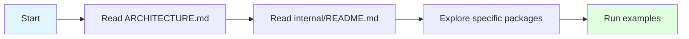
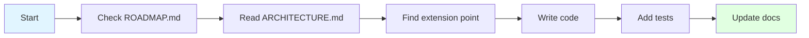

# Developer Guide

Welcome to the drun developer documentation! This guide will help you understand the codebase, contribute features, and navigate the architecture.

---

## Quick Start for Developers

1. **Understand the architecture** → Read [ARCHITECTURE.md](./ARCHITECTURE.md)
2. **Navigate the code** → Read [internal/README.md](./internal/README.md)
3. **Learn the language** → Read [DRUN_V2_SPECIFICATION.md](./DRUN_V2_SPECIFICATION.md)
4. **See what's planned** → Read [ROADMAP.md](./ROADMAP.md)

---

## Documentation Index

### Architecture & Design

| Document | Purpose | When to Read |
|----------|---------|--------------|
| **[ARCHITECTURE.md](./ARCHITECTURE.md)** | Complete system architecture with diagrams | Understanding how components work together |
| **[internal/README.md](./internal/README.md)** | Package-by-package guide | Navigating the codebase |
| **[CONTRIBUTING.md](./CONTRIBUTING.md)** | How to contribute code | Adding features or fixing bugs |

### Language Specification

| Document | Purpose | When to Read |
|----------|---------|--------------|
| **[DRUN_V2_SPECIFICATION.md](./DRUN_V2_SPECIFICATION.md)** | Complete language specification | Understanding drun syntax |
| **[DRUN_LLM_USAGE_MANUAL.md](./DRUN_LLM_USAGE_MANUAL.md)** | How to write drun code | Creating drun files |
| **[examples/](./examples/)** | 62 working examples | Learning by example |

### Project Planning

| Document | Purpose | When to Read |
|----------|---------|--------------|
| **[ROADMAP.md](./ROADMAP.md)** | Feature roadmap | Planning contributions |

### Package Documentation

| Document | Purpose | When to Read |
|----------|---------|--------------|
| **[internal/README.md](./internal/README.md)** | Internal packages guide | Working with the codebase |
| **[internal/parser/README.md](./internal/parser/README.md)** | Parser architecture | Adding parser features |
| **[internal/engine/README.md](./internal/engine/README.md)** | Engine architecture | Adding execution features |

---

## Common Tasks

### I want to understand how drun works



**Reading order:**
1. [ARCHITECTURE.md](./ARCHITECTURE.md) - See the big picture with diagrams
2. [internal/README.md](./internal/README.md) - Understand package organization
3. Pick a package and explore its files
4. Run examples in [examples/](./examples/)

### I want to add a new feature



**Steps:**
1. Check [ROADMAP.md](./ROADMAP.md) - Is it already planned?
2. Read [ARCHITECTURE.md](./ARCHITECTURE.md) - Where does it fit?
3. Read [internal/README.md](./internal/README.md) - Find the right package
4. Follow the "Adding New Actions" guide in [ARCHITECTURE.md](./ARCHITECTURE.md#adding-new-actions)
5. Add tests in the appropriate `*_test.go` file
6. Update documentation

### I want to fix a bug

**Debugging flow:**
1. **Lexer issues** → Check [internal/lexer/](./internal/lexer/)
2. **Parser errors** → Check [internal/parser/](./internal/parser/)
3. **Runtime errors** → Check [internal/engine/](./internal/engine/)
4. **Variable issues** → Check [internal/engine/interpolation/](./internal/engine/interpolation/)

**Resources:**
- [internal/README.md](./internal/README.md) - Package guide
- [ARCHITECTURE.md](./ARCHITECTURE.md) - Execution flow diagrams

### I want to understand the architecture

**How is the code organized?**

Read these in order:
1. [ARCHITECTURE.md](./ARCHITECTURE.md) - System architecture with diagrams
2. [internal/README.md](./internal/README.md) - Package organization
3. [CONTRIBUTING.md](./CONTRIBUTING.md) - How to contribute

**Refactoring results:**
- AST refactored (1,133 lines → 15 focused files)
- Parser refactored (4,874 lines → 26 focused files)
- Engine refactored (5,179 lines → 36 focused files)
- CLI refactored (1,137 lines → 440 lines + 4 modules)

---

## Architecture Overview

### System Layers

```
┌─────────────────────────────────────┐
│  CLI Layer (cmd/drun/)              │  User interaction
├─────────────────────────────────────┤
│  Engine Layer (internal/engine/)    │  Execution orchestration
├─────────────────────────────────────┤
│  Parser Layer (internal/parser/)    │  Syntax analysis
├─────────────────────────────────────┤
│  Lexer Layer (internal/lexer/)      │  Tokenization
├─────────────────────────────────────┤
│  AST Layer (internal/ast/)          │  Tree structure
├─────────────────────────────────────┤
│  Support (builtins, shell, etc.)    │  Utilities
└─────────────────────────────────────┘
```

**For detailed diagrams:** See [ARCHITECTURE.md](./ARCHITECTURE.md)

### Package Organization

```
internal/
├── ast/               # 15 files - AST node definitions
├── parser/            # 26 files - Syntax parsing
├── engine/            # 36 files - Execution engine
│   ├── interpolation/ # Variable interpolation
│   ├── hooks/         # Lifecycle hooks
│   └── includes/      # Include resolution
├── lexer/             # 6 files - Tokenization
└── (support packages) # builtins, shell, detection, etc.
```

**For detailed breakdown:** See [internal/README.md](./internal/README.md)

---

## Testing

### Running Tests

```bash
# All tests
go test ./...

# Specific package
go test ./internal/parser/...

# With coverage
go test -cover ./...

# Run examples (regression tests)
./scripts/test.sh
```

### Test Organization

- **Unit tests:** `*_test.go` files in each package
- **Integration tests:** `internal/engine/*_test.go`
- **Regression tests:** All 62 files in `examples/`

### Writing Tests

```go
// internal/parser/parser_docker_test.go
func TestParseDockerBuild(t *testing.T) {
    input := `build docker image "myapp:latest"`
    l := lexer.New(input)
    p := New(l)
    
    stmt, err := p.parseDockerStatement()
    assert.NoError(t, err)
    assert.Equal(t, "build", stmt.Action)
}
```

**For testing strategy:** See [internal/README.md](./internal/README.md#testing-strategy)

---

## Code Style

### File Organization

**Keep files small and focused:**
- AST definitions: 100-200 lines
- Parsers: 200-300 lines
- Executors: 150-250 lines
- Helpers: 100-200 lines

**Group by domain:**
```
Good: ast_docker.go, parser_docker.go, executor_docker.go
Bad: ast.go (all AST in one file)
```

### Naming Conventions

```go
// Public APIs - exported
func NewEngine() *Engine
func (e *Engine) RunTask(name string) error

// Internal helpers - unexported
func (e *Engine) executeStatement(stmt ast.Statement) error
func (e *Engine) interpolateVariables(s string) string
```

### Error Handling

```go
// Always provide context
if err != nil {
    return fmt.Errorf("failed to execute task '%s': %w", taskName, err)
}

// Use custom errors when appropriate
return errors.NewExecutionError("task failed", ctx)
```

**For design patterns:** See [ARCHITECTURE.md](./ARCHITECTURE.md#key-design-patterns)

---

## Adding New Features

### Example: Adding a New Action Type

Let's say you want to add `notify slack "message"`:

#### 1. Define AST Node

Create `internal/ast/ast_slack.go`:

```go
package ast

type SlackStatement struct {
    Action  string // "notify"
    Channel string
    Message string
}

func (s *SlackStatement) statementNode() {}
```

#### 2. Add Parser

Create `internal/parser/parser_slack.go`:

```go
package parser

func (p *Parser) parseSlackStatement() (*ast.SlackStatement, error) {
    stmt := &ast.SlackStatement{}
    
    if !p.expectPeek(IDENT) {
        return nil, p.error("expected 'slack'")
    }
    
    // Parse channel, message...
    
    return stmt, nil
}
```

Wire it up in `parser_action.go`:

```go
case "notify":
    if p.peekTokenIs(IDENT) && p.peekToken.Literal == "slack" {
        return p.parseSlackStatement()
    }
```

#### 3. Add Executor

Create `internal/engine/executor_slack.go`:

```go
package engine

func (e *Engine) executeSlack(stmt *ast.SlackStatement, ctx *ExecutionContext) error {
    // Interpolate variables
    message, err := e.interpolator.InterpolateString(stmt.Message, ctx)
    if err != nil {
        return err
    }
    
    // Send to Slack...
    
    return nil
}
```

Wire it up in `engine.go`:

```go
case *ast.SlackStatement:
    return e.executeSlack(s, ctx)
```

#### 4. Add Tests

Create `internal/parser/parser_slack_test.go` and `internal/engine/executor_slack_test.go`

#### 5. Update Documentation

- Add to [ROADMAP.md](./ROADMAP.md)
- Add example to `examples/`
- Update [ARCHITECTURE.md](./ARCHITECTURE.md) if needed

**For detailed examples:** See [ARCHITECTURE.md](./ARCHITECTURE.md#extension-points)

---

## Key Concepts

### AST (Abstract Syntax Tree)

The tree representation of drun code:

```
Program
└── Task("build")
    ├── ShellStatement("npm install")
    ├── DockerStatement("build", "myapp:latest")
    └── ConditionalStatement
        └── ShellStatement("npm test")
```

**Learn more:** [internal/README.md](./internal/README.md#ast---abstract-syntax-tree)

### Execution Context

Runtime state during execution:

```go
type ExecutionContext struct {
    Variables    map[string]string
    Parameters   map[string]string
    TaskStack    []string
    LoopStack    []LoopContext
    // ...
}
```

**Learn more:** [ARCHITECTURE.md](./ARCHITECTURE.md#context-hierarchy)

### Interpolation

Variable replacement in strings:

```
"Hello {$name}" → "Hello World"
"{$files} filtered by extension '.js'" → "app.js,test.js"
```

**Learn more:** [ARCHITECTURE.md](./ARCHITECTURE.md#variable-resolution-and-interpolation)

### Executors

Components that execute specific statement types:

- `executor_shell.go` - Shell commands
- `executor_docker.go` - Docker actions
- `executor_git.go` - Git actions
- etc.

**Learn more:** [internal/README.md](./internal/README.md#executors)

---

## Best Practices

### 1. Single Responsibility

Each file/function does ONE thing well:

```go
Good: func parseDockerBuild() - Parses Docker build statements
Bad: func parseAction() - Parses all action types (too broad)
```

### 2. Clear Error Messages

```go
Good: return fmt.Errorf("task 'build' not found in project")
Bad: return errors.New("not found")
```

### 3. Test at the Right Level

```go
// Unit test - test parser alone
func TestParseDockerBuild(t *testing.T) { ... }

// Integration test - test full execution
func TestDockerBuildExecution(t *testing.T) { ... }
```

### 4. Document Public APIs

```go
// NewEngine creates a new execution engine.
// The output writer receives all command output and status messages.
func NewEngine(output io.Writer) *Engine { ... }
```

### 5. Keep It Simple

```go
Good: Small functions, clear names, obvious logic
Bad: Clever tricks, complex abstractions, hidden behavior
```

---

## Debugging Tips

### Parser Issues

```bash
# Enable debug output
xdrun --debug --ast task_name

# Check token stream
xdrun --debug --tokens task_name
```

### Execution Issues

```bash
# Verbose mode
xdrun -v task_name

# Dry run (no actual execution)
xdrun --dry-run task_name
```

### Variable Issues

Check interpolation logic in:
- `internal/engine/interpolation/interpolator.go`
- `internal/engine/interpolation/resolvers.go`

---

## Project Statistics

**Current Architecture:**

| Metric | Before | After | Improvement |
|--------|--------|-------|-------------|
| Largest file | 5,179 lines | 911 lines | 5.7x better |
| Average file | 1,230 lines | 158 lines | 7.8x better |
| Total files | 4 monoliths | 95+ focused | 23x more organized |
| Test coverage | Good | Excellent | Better isolation |

**Current Status:**
- 58 tests passing
- 62 examples working
- All features functional
- Zero regressions

---

## Next Steps

### For New Contributors

1. Read [ARCHITECTURE.md](./ARCHITECTURE.md)
2. Read [internal/README.md](./internal/README.md)
3. Run the examples: `cd examples && xdrun -l`
4. Pick a feature from [ROADMAP.md](./ROADMAP.md)
5. Open a PR!

### For Maintainers

1. Review [ROADMAP.md](./ROADMAP.md) for planned features
2. Continue feature development
3. Maintain code quality standards

---

## Getting Help

### Documentation Navigation

```
Need to understand...                    → Read...
─────────────────────────────────────────────────────────────
How the system works                    → ARCHITECTURE.md
How to navigate the code                → internal/README.md
The drun language                       → DRUN_V2_SPECIFICATION.md
What's planned                          → ROADMAP.md
How to contribute                       → CONTRIBUTING.md
```

### Quick Links

- [Architecture Overview](./ARCHITECTURE.md)
- [Package Guide](./internal/README.md)
- [Language Spec](./DRUN_V2_SPECIFICATION.md)
- [Roadmap](./ROADMAP.md)
- [Examples](./examples/)

---

## Summary

**drun is now:**
- Well-organized (95+ focused files)
- Well-documented (15+ guides)
- Well-tested (58 tests, 62 examples)
- Well-architected (clean, modular design)
- Ready for contributions

**Start with:**
1. [ARCHITECTURE.md](./ARCHITECTURE.md) for the big picture
2. [internal/README.md](./internal/README.md) for code navigation
3. [examples/](./examples/) to see it in action

Happy coding!

---

*Last Updated: October 5, 2025*  
*Version: 2.0*
