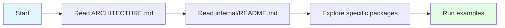
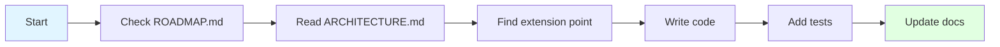

# Developer Guide

Welcome to the drun developer documentation! This guide will help you understand the codebase, contribute features, and navigate the architecture.

---

## Quick Start for Developers

1. **Understand the architecture** → Read [ARCHITECTURE.md](./ARCHITECTURE.md)
2. **Navigate the code** → Read [internal/README.md](./internal/README.md)
3. **Learn the language** → Read [DRUN_V2_SPECIFICATION.md](./DRUN_V2_SPECIFICATION.md)
4. **See what's planned** → Read [ROADMAP.md](./ROADMAP.md)

---

## Documentation Index

### Architecture & Design

| Document | Purpose | When to Read |
|----------|---------|--------------|
| **[ARCHITECTURE.md](./ARCHITECTURE.md)** | Complete system architecture with diagrams | Understanding how components work together |
| **[internal/README.md](./internal/README.md)** | Package-by-package guide | Navigating the codebase |
| **[CONTRIBUTING.md](./CONTRIBUTING.md)** | How to contribute code | Adding features or fixing bugs |

### Language Specification

| Document | Purpose | When to Read |
|----------|---------|--------------|
| **[DRUN_V2_SPECIFICATION.md](./DRUN_V2_SPECIFICATION.md)** | Complete language specification | Understanding drun syntax |
| **[DRUN_LLM_USAGE_MANUAL.md](./DRUN_LLM_USAGE_MANUAL.md)** | How to write drun code | Creating drun files |
| **[examples/](./examples/)** | 62 working examples | Learning by example |

### Project Planning

| Document | Purpose | When to Read |
|----------|---------|--------------|
| **[ROADMAP.md](./ROADMAP.md)** | Feature roadmap | Planning contributions |

### Package Documentation

| Document | Purpose | When to Read |
|----------|---------|--------------|
| **[internal/README.md](./internal/README.md)** | Internal packages guide | Working with the codebase |
| **[internal/parser/README.md](./internal/parser/README.md)** | Parser architecture | Adding parser features |
| **[internal/engine/README.md](./internal/engine/README.md)** | Engine architecture | Adding execution features |

---

## Common Tasks

### I want to understand how drun works



**Reading order:**
1. [ARCHITECTURE.md](./ARCHITECTURE.md) - See the big picture with diagrams
2. [internal/README.md](./internal/README.md) - Understand package organization
3. Pick a package and explore its files
4. Run examples in [examples/](./examples/)

### I want to add a new feature



**Steps:**
1. Check [ROADMAP.md](./ROADMAP.md) - Is it already planned?
2. Read [ARCHITECTURE.md](./ARCHITECTURE.md) - Where does it fit?
3. Read [internal/README.md](./internal/README.md) - Find the right package
4. Follow the "Adding New Actions" guide in [ARCHITECTURE.md](./ARCHITECTURE.md#adding-new-actions)
5. Add tests in the appropriate `*_test.go` file
6. Update documentation

### I want to fix a bug

**Debugging flow:**
1. **Lexer issues** → Check [internal/lexer/](./internal/lexer/)
2. **Parser errors** → Check [internal/parser/](./internal/parser/)
3. **Runtime errors** → Check [internal/engine/](./internal/engine/)
4. **Variable issues** → Check [internal/engine/interpolation/](./internal/engine/interpolation/)

**Resources:**
- [internal/README.md](./internal/README.md) - Package guide
- [ARCHITECTURE.md](./ARCHITECTURE.md) - Execution flow diagrams

### I want to understand the architecture

**How is the code organized?**

Read these in order:
1. [ARCHITECTURE.md](./ARCHITECTURE.md) - System architecture with diagrams
2. [internal/README.md](./internal/README.md) - Package organization
3. [CONTRIBUTING.md](./CONTRIBUTING.md) - How to contribute


---

## Architecture Overview

### System Layers

```
┌─────────────────────────────────────┐
│  CLI Layer (cmd/drun/)              │  User interaction & debug flags
├─────────────────────────────────────┤
│  Domain Layer (internal/domain/)    │  Business logic (decoupled from AST)
│    • task/ - Task entities          │
│    • parameter/ - Validation        │
│    • statement/ - Domain statements │
├─────────────────────────────────────┤
│  Engine Layer (internal/engine/)    │  Modular execution orchestration
│    • planner/ - Execution planning  │
│    • executor/ - Task execution     │
│    • options.go - DI configuration  │
├─────────────────────────────────────┤
│  Parser Layer (internal/parser/)    │  Syntax analysis
├─────────────────────────────────────┤
│  Lexer Layer (internal/lexer/)      │  Tokenization
├─────────────────────────────────────┤
│  AST Layer (internal/ast/)          │  Tree structure
├─────────────────────────────────────┤
│  Debug Layer (internal/debug/)      │  Plan visualization & diagnostics
├─────────────────────────────────────┤
│  Support (builtins, shell, etc.)    │  Utilities
└─────────────────────────────────────┘
```

**For detailed diagrams:** See [ARCHITECTURE.md](./ARCHITECTURE.md)

### Package Organization

```
internal/
├── ast/               # 15 files - AST node definitions
├── parser/            # 26 files - Syntax parsing
├── domain/            # Domain layer (decoupled from AST)
│   ├── task/          # Task entities, registry, dependencies
│   ├── parameter/     # Parameter validation & constraints
│   ├── project/       # Project entities
│   └── statement/     # Domain statement types & converters
├── engine/            # Modular execution engine
│   ├── planner/       # Execution planning & dependency resolution
│   ├── executor/      # Task & hook execution
│   ├── interpolation/ # Variable interpolation
│   ├── hooks/         # Lifecycle hooks
│   ├── includes/      # Include resolution
│   ├── engine.go      # Core orchestration
│   └── options.go     # Dependency injection configuration
├── debug/             # Debug utilities & plan visualization
│   ├── debug.go       # Core debug functions
│   └── plan.go        # Execution plan export (Graphviz, Mermaid, JSON)

### Domain Layer Integration

The domain layer contains business logic separated from execution concerns:

**Domain Services (fully integrated with engine):**

1. **Task Registry** (`internal/domain/task/registry.go`)
   - Manages task registration and lookup
   - Preserves task insertion order
   - Thread-safe operations
   - **Used by**: Task listing, dependency resolution

2. **Dependency Resolver** (`internal/domain/task/dependencies.go`)
   - Resolves task execution order
   - Detects circular dependencies
   - Supports parallel/sequential execution groups
   - **Used by**: Task execution planning

3. **Parameter Validator** (`internal/domain/parameter/validation.go`)
   - Validates parameter types and constraints
   - Checks range constraints (min/max)
   - Validates patterns (regex, email, semver, etc.)
   - **Used by**: All parameter validation (task, project, template)

**Engine Integration Points:**

```go
// Engine uses domain services and modular components
type Engine struct {
    taskRegistry   *task.Registry          // Task management
    paramValidator *parameter.Validator    // Parameter validation
    depResolver    *task.DependencyResolver // Dependency resolution
    planner        *planner.Planner        // Execution planning
    executor       *executor.Executor      // Task execution
    // ... other fields
}

// Example: Modular execution flow
func (e *Engine) ExecuteWithParamsAndFile(...) error {
    // 1. Register tasks in domain registry
    e.registerTasks(program.Tasks, currentFile)
    
    // 2. Create comprehensive execution plan
    plan, err := e.planner.Plan(taskName, program, projectCtx)
    
    // 3. Execute using plan (no redundant AST scans)
    for _, taskName := range plan.ExecutionOrder {
        taskPlan, _ := plan.GetTask(taskName)
        // Execute task using domain statements
        for _, stmt := range taskPlan.Body {
            e.executeDomainStatement(stmt, ctx)
        }
    }
}
```

**Architectural Benefits:**
- **Domain-Driven** - Business logic separated from infrastructure
- **Explicit Planning** - Upfront execution plan eliminates waste
- **Modular Components** - Planner, Executor work with clear interfaces
- **Dependency Injection** - Options-based configuration for testing
- **Debug Diagnostics** - Rich visualization tools (Graphviz, Mermaid, JSON)

├── lexer/             # 6 files - Tokenization
└── (support packages) # builtins, shell, detection, etc.
```

**For detailed breakdown:** See [internal/README.md](./internal/README.md)

---


---

## Adding New Features with Domain Layer

This example shows how to add a new feature using proper domain layer separation.

### Example: Adding Task Priority System

Let's add a priority system to tasks (low, medium, high) with validation and sorting.

#### Step 1: Add Domain Entity Field

**File: `internal/domain/task/task.go`**

```go
// Task represents a domain task entity
type Task struct {
    Name         string
    Description  string
    Priority     string      // NEW: Add priority field
    Parameters   []Parameter
    Dependencies []Dependency
    Body         []ast.Statement
    Namespace    string
    Source       string
}

// Priority constants
const (
    PriorityLow    = "low"
    PriorityMedium = "medium"
    PriorityHigh   = "high"
)

// ValidPriorities lists all valid priority values
var ValidPriorities = []string{PriorityLow, PriorityMedium, PriorityHigh}
```

#### Step 2: Add Domain Validation Logic

**File: `internal/domain/task/task.go`** (add to `Validate` method)

```go
// Validate validates the task
func (t *Task) Validate() error {
    if t.Name == "" {
        return &TaskError{
            Task:    t.Name,
            Message: "task name cannot be empty",
        }
    }

    // NEW: Validate priority
    if t.Priority != "" {
        valid := false
        for _, p := range ValidPriorities {
            if t.Priority == p {
                valid = true
                break
            }
        }
        if !valid {
            return &TaskError{
                Task:    t.Name,
                Message: fmt.Sprintf("invalid priority '%s', must be one of: %v", 
                    t.Priority, ValidPriorities),
            }
        }
    }

    // ... existing validation
    return nil
}
```

#### Step 3: Add Domain Service Method

**File: `internal/domain/task/registry.go`**

```go
// ListByPriority returns tasks sorted by priority (high -> medium -> low)
func (r *Registry) ListByPriority() []*Task {
    r.mu.RLock()
    defer r.mu.RUnlock()

    // Group by priority
    high := make([]*Task, 0)
    medium := make([]*Task, 0)
    low := make([]*Task, 0)
    unspecified := make([]*Task, 0)

    for _, name := range r.taskOrder {
        if task, exists := r.tasks[name]; exists {
            switch task.Priority {
            case PriorityHigh:
                high = append(high, task)
            case PriorityMedium:
                medium = append(medium, task)
            case PriorityLow:
                low = append(low, task)
            default:
                unspecified = append(unspecified, task)
            }
        }
    }

    // Combine in priority order
    result := make([]*Task, 0, len(r.taskOrder))
    result = append(result, high...)
    result = append(result, medium...)
    result = append(result, low...)
    result = append(result, unspecified...)
    
    return result
}
```

#### Step 4: Parse from AST

**File: `internal/domain/task/task.go`** (update `NewTask`)

```go
// NewTask creates a new task from AST
func NewTask(stmt *ast.TaskStatement, namespace, source string) *Task {
    task := &Task{
        Name:        stmt.Name,
        Description: stmt.Description,
        Priority:    stmt.Priority, // NEW: Read from AST
        Namespace:   namespace,
        Source:      source,
        Body:        stmt.Body,
    }
    
    // ... rest of conversion
    return task
}
```

#### Step 5: Update AST (if needed)

**File: `internal/ast/statements/task_statement.go`**

```go
type TaskStatement struct {
    Token        lexer.Token
    Name         string
    Description  string
    Priority     string      // NEW: Add priority field
    Parameters   []ParameterStatement
    Dependencies []DependencyGroup
    Body         []ast.Statement
}
```

#### Step 6: Integrate with Engine

**File: `internal/engine/engine.go`**

```go
// ListTasksByPriority returns tasks ordered by priority
func (e *Engine) ListTasksByPriority(program *ast.Program) []TaskInfo {
    // Register tasks with domain registry
    e.taskRegistry.Clear()
    _ = e.registerTasks(program.Tasks, "")

    // Get tasks from domain registry sorted by priority
    domainTasks := e.taskRegistry.ListByPriority()
    
    tasks := make([]TaskInfo, 0, len(domainTasks))
    for _, domainTask := range domainTasks {
        info := TaskInfo{
            Name:        domainTask.Name,
            Description: domainTask.Description,
            Priority:    domainTask.Priority, // NEW
        }
        if info.Description == "" {
            info.Description = "No description"
        }
        tasks = append(tasks, info)
    }
    return tasks
}
```

#### Step 7: Add CLI Support (Optional)

**File: `cmd/drun/app/cli.go`**

```go
// Add new flag
flags.BoolVar(&a.listByPriority, "list-priority", false, "List tasks sorted by priority")

// Handle in run method
if a.listByPriority {
    return ListTasksByPriority(a.configFile)
}
```

### Key Principles Demonstrated

1. **Domain First**: Define the concept in the domain layer (`Task.Priority`)
2. **Domain Validation**: Business rules stay in domain (`ValidPriorities`, `Validate()`)
3. **Domain Services**: Logic operates on domain entities (`ListByPriority()`)
4. **Clean Integration**: Engine orchestrates, doesn't contain business logic
5. **Separation**: AST → Domain → Engine → CLI (clear boundaries)

### Why This Pattern Works

```
┌─────────────────────────────────────────────────┐
│ CLI Layer: User interaction                     │
│  - Flags, commands, output formatting           │
└────────────────┬────────────────────────────────┘
                 │
┌────────────────▼────────────────────────────────┐
│ Engine Layer: Orchestration                     │
│  - Converts AST → Domain                        │
│  - Calls domain services                        │
│  - Manages execution flow                       │
└────────────────┬────────────────────────────────┘
                 │
┌────────────────▼────────────────────────────────┐
│ Domain Layer: Business Logic                    │
│  - Task priority validation                     │
│  - Priority-based sorting                       │
│  - Domain rules and constraints                 │
└─────────────────────────────────────────────────┘
```

**Benefits:**
- ✅ Easy to test (domain logic isolated)
- ✅ Reusable (priority logic works anywhere)
- ✅ Maintainable (change priority rules in one place)
- ✅ Clear (each layer has single responsibility)

### Testing the Domain Layer

**File: `internal/domain/task/task_test.go`**

```go
func TestTaskPriorityValidation(t *testing.T) {
    tests := []struct {
        name     string
        priority string
        wantErr  bool
    }{
        {"valid high", "high", false},
        {"valid medium", "medium", false},
        {"valid low", "low", false},
        {"invalid priority", "critical", true},
        {"empty priority", "", false}, // Optional field
    }

    for _, tt := range tests {
        t.Run(tt.name, func(t *testing.T) {
            task := &Task{
                Name:     "test",
                Priority: tt.priority,
            }
            err := task.Validate()
            if (err != nil) != tt.wantErr {
                t.Errorf("Validate() error = %v, wantErr %v", err, tt.wantErr)
            }
        })
    }
}

func TestRegistryListByPriority(t *testing.T) {
    registry := NewRegistry()
    
    // Register tasks with different priorities
    registry.Register(&Task{Name: "task1", Priority: "low"})
    registry.Register(&Task{Name: "task2", Priority: "high"})
    registry.Register(&Task{Name: "task3", Priority: "medium"})
    
    tasks := registry.ListByPriority()
    
    // Should be ordered: high, medium, low
    if tasks[0].Name != "task2" || tasks[0].Priority != "high" {
        t.Error("Expected high priority task first")
    }
    if tasks[1].Name != "task3" || tasks[1].Priority != "medium" {
        t.Error("Expected medium priority task second")
    }
    if tasks[2].Name != "task1" || tasks[2].Priority != "low" {
        t.Error("Expected low priority task third")
    }
}
```

### Summary: Domain-Driven Development Flow

When adding any new feature:

1. **Think Domain First**: What's the business concept?
2. **Add to Domain Layer**: Entities, validation, services
3. **Test Domain Logic**: Unit tests without dependencies
4. **Integrate with Engine**: Orchestrate domain operations
5. **Expose via CLI**: User-facing interface

This keeps your codebase clean, testable, and maintainable! 🎯

## Testing

### Running Tests

```bash
# All tests
go test ./...

# Specific package
go test ./internal/parser/...

# With coverage
go test -cover ./...

# Run examples (regression tests)
./scripts/test.sh
```

### Test Organization

- **Unit tests:** `*_test.go` files in each package
- **Integration tests:** `internal/engine/*_test.go`
- **Regression tests:** All 62 files in `examples/`

### Writing Tests

```go
// internal/parser/parser_docker_test.go
func TestParseDockerBuild(t *testing.T) {
    input := `build docker image "myapp:latest"`
    l := lexer.New(input)
    p := New(l)
    
    stmt, err := p.parseDockerStatement()
    assert.NoError(t, err)
    assert.Equal(t, "build", stmt.Action)
}
```

**For testing strategy:** See [internal/README.md](./internal/README.md#testing-strategy)

---

## Code Style

### File Organization

**Keep files small and focused:**
- AST definitions: 100-200 lines
- Parsers: 200-300 lines
- Executors: 150-250 lines
- Helpers: 100-200 lines

**Group by domain:**
```
Good: ast_docker.go, parser_docker.go, executor_docker.go
Bad: ast.go (all AST in one file)
```

### Naming Conventions

```go
// Public APIs - exported
func NewEngine() *Engine
func (e *Engine) RunTask(name string) error

// Internal helpers - unexported
func (e *Engine) executeStatement(stmt ast.Statement) error
func (e *Engine) interpolateVariables(s string) string
```

### Error Handling

```go
// Always provide context
if err != nil {
    return fmt.Errorf("failed to execute task '%s': %w", taskName, err)
}

// Use custom errors when appropriate
return errors.NewExecutionError("task failed", ctx)
```

**For design patterns:** See [ARCHITECTURE.md](./ARCHITECTURE.md#key-design-patterns)

---

## Adding New Features

### Example: Adding a New Action Type

Let's say you want to add `notify slack "message"`:

#### 1. Define AST Node

Create `internal/ast/ast_slack.go`:

```go
package ast

type SlackStatement struct {
    Action  string // "notify"
    Channel string
    Message string
}

func (s *SlackStatement) statementNode() {}
```

#### 2. Define Domain Statement

Create `internal/domain/statement/slack.go` (or add to `statement.go`):

```go
package statement

// Slack represents a Slack notification action
type Slack struct {
    Action  string
    Channel string
    Message string
}

func (s *Slack) Type() StatementType { return "slack" }
```

#### 3. Add Domain Converter

Add to `internal/domain/statement/converter.go`:

```go
// In FromAST function
case *ast.SlackStatement:
    return &Slack{
        Action:  s.Action,
        Channel: s.Channel,
        Message: s.Message,
    }, nil

// In ToAST function (temporary bridge)
case *Slack:
    return &ast.SlackStatement{
        Action:  s.Action,
        Channel: s.Channel,
        Message: s.Message,
    }, nil
```

#### 4. Add Parser

Create `internal/parser/parser_slack.go`:

```go
package parser

func (p *Parser) parseSlackStatement() (*ast.SlackStatement, error) {
    stmt := &ast.SlackStatement{}
    
    if !p.expectPeek(IDENT) {
        return nil, p.error("expected 'slack'")
    }
    
    // Parse channel, message...
    
    return stmt, nil
}
```

Wire it up in `parser_action.go`:

```go
case "notify":
    if p.peekTokenIs(IDENT) && p.peekToken.Literal == "slack" {
        return p.parseSlackStatement()
    }
```

#### 5. Add Executor

Create `internal/engine/executor_slack.go`:

```go
package engine

func (e *Engine) executeSlack(stmt *ast.SlackStatement, ctx *ExecutionContext) error {
    // Interpolate variables
    message := e.interpolateVariables(stmt.Message, ctx)
    
    // Send to Slack...
    
    return nil
}
```

Wire it up in `executeDomainStatement` in `engine.go`:

```go
case *statement.Slack:
    return e.executeSlack(&ast.SlackStatement{
        Action:  s.Action,
        Channel: s.Channel,
        Message: s.Message,
    }, ctx)
```

#### 6. Add Tests

Create:
- `internal/parser/parser_slack_test.go` - Parser tests
- `internal/domain/statement/slack_test.go` - Domain converter tests  
- `internal/engine/executor_slack_test.go` - Executor tests

#### 7. Update Documentation

- Add to [ROADMAP.md](./ROADMAP.md)
- Add example to `examples/`
- Update [ARCHITECTURE.md](./ARCHITECTURE.md) if needed

**For detailed examples:** See [ARCHITECTURE.md](./ARCHITECTURE.md#extension-points)

---

## Key Concepts

### AST (Abstract Syntax Tree)

The tree representation of drun code:

```
Program
└── Task("build")
    ├── ShellStatement("npm install")
    ├── DockerStatement("build", "myapp:latest")
    └── ConditionalStatement
        └── ShellStatement("npm test")
```

**Learn more:** [internal/README.md](./internal/README.md#ast---abstract-syntax-tree)

### Execution Context

Runtime state during execution:

```go
type ExecutionContext struct {
    Variables    map[string]string
    Parameters   map[string]string
    TaskStack    []string
    LoopStack    []LoopContext
    // ...
}
```

**Learn more:** [ARCHITECTURE.md](./ARCHITECTURE.md#context-hierarchy)

### Interpolation

Variable replacement in strings:

```
"Hello {$name}" → "Hello World"
"{$files} filtered by extension '.js'" → "app.js,test.js"
```

**Learn more:** [ARCHITECTURE.md](./ARCHITECTURE.md#variable-resolution-and-interpolation)

### Executors

Components that execute specific statement types:

- `executor_shell.go` - Shell commands
- `executor_docker.go` - Docker actions
- `executor_git.go` - Git actions
- etc.

**Learn more:** [internal/README.md](./internal/README.md#executors)

---

## Best Practices

### 1. Single Responsibility

Each file/function does ONE thing well:

```go
Good: func parseDockerBuild() - Parses Docker build statements
Bad: func parseAction() - Parses all action types (too broad)
```

### 2. Clear Error Messages

```go
Good: return fmt.Errorf("task 'build' not found in project")
Bad: return errors.New("not found")
```

### 3. Test at the Right Level

```go
// Unit test - test parser alone
func TestParseDockerBuild(t *testing.T) { ... }

// Integration test - test full execution
func TestDockerBuildExecution(t *testing.T) { ... }
```

### 4. Document Public APIs

```go
// NewEngine creates a new execution engine.
// The output writer receives all command output and status messages.
func NewEngine(output io.Writer) *Engine { ... }
```

### 5. Keep It Simple

```go
Good: Small functions, clear names, obvious logic
Bad: Clever tricks, complex abstractions, hidden behavior
```

---

## Debugging Tips

### Parser Issues

```bash
# Enable debug output
xdrun --debug --ast task_name

# Check token stream
xdrun --debug --tokens task_name
```

### Execution Issues

```bash
# Verbose mode
xdrun -v task_name

# Dry run (no actual execution)
xdrun --dry-run task_name
```

### Execution Plan Debugging

```bash
# View execution plan
xdrun --debug --debug-domain --debug-plan -f myfile.drun

# Export plan as Graphviz (render with dot)
xdrun --debug --debug-domain --debug-export-graph plan -f myfile.drun
dot -Tpng plan-mytask.dot -o plan.png

# Export plan as Mermaid
xdrun --debug --debug-domain --debug-export-mermaid plan -f myfile.drun

# Export plan as JSON
xdrun --debug --debug-domain --debug-export-json plan -f myfile.drun
```

**Plan diagnostics show:**
- Complete execution order
- Task dependencies
- Parameter metadata
- Hook integration points
- Project and namespace information

### Variable Issues

Check interpolation logic in:
- `internal/engine/interpolation/interpolator.go`
- `internal/engine/interpolation/resolvers.go`

---

## Project Statistics

**Architecture Evolution:**

| Metric | Value | Notes |
|--------|-------|-------|
| Domain Decoupling | ✅ Complete | Tasks/Projects use domain statements |
| Execution Planning | ✅ Implemented | Planner generates comprehensive plans |
| Dependency Injection | ✅ Available | Options-based configuration |
| Debug Diagnostics | ✅ Available | Graphviz, Mermaid, JSON exports |
| Code Organization | 100+ focused files | Modular, maintainable structure |

**Current Status:**
- ✅ All unit tests passing
- ✅ 60 examples working
- ✅ All features functional
- ✅ Zero regressions
- ✅ Production ready

---

## Next Steps

### For New Contributors

1. Read [ARCHITECTURE.md](./ARCHITECTURE.md)
2. Read [internal/README.md](./internal/README.md)
3. Run the examples: `cd examples && xdrun -l`
4. Pick a feature from [ROADMAP.md](./ROADMAP.md)
5. Open a PR!

### For Maintainers

1. Review [ROADMAP.md](./ROADMAP.md) for planned features
2. Continue feature development
3. Maintain code quality standards

---

## Getting Help

### Documentation Navigation

```
Need to understand...                    → Read...
─────────────────────────────────────────────────────────────
How the system works                    → ARCHITECTURE.md
How to navigate the code                → internal/README.md
The drun language                       → DRUN_V2_SPECIFICATION.md
What's planned                          → ROADMAP.md
How to contribute                       → CONTRIBUTING.md
```

### Quick Links

- [Architecture Overview](./ARCHITECTURE.md)
- [Package Guide](./internal/README.md)
- [Language Spec](./DRUN_V2_SPECIFICATION.md)
- [Roadmap](./ROADMAP.md)
- [Examples](./examples/)

---

## Summary

**drun is now:**
- ✅ Well-organized (100+ focused files, modular architecture)
- ✅ Well-documented (15+ guides with architecture details)
- ✅ Well-tested (all tests passing, 60 examples verified)
- ✅ Well-architected (domain-driven, explicit planning, DI)
- ✅ Well-equipped (debug diagnostics, plan visualization)
- ✅ Ready for contributions

**Start with:**
1. [ARCHITECTURE.md](./ARCHITECTURE.md) for the big picture
2. [internal/domain/README.md](./internal/domain/README.md) for domain layer
3. [internal/engine/README.md](./internal/engine/README.md) for engine architecture
4. [examples/](./examples/) to see it in action

Happy coding!

---

*Last Updated: October 9, 2025*  
*Version: 2.1 - Modular Architecture*
